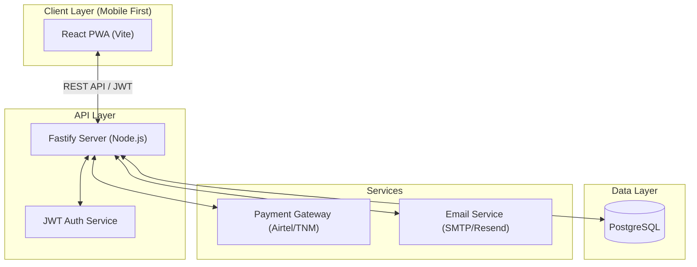

# WorkBridge

## MVP Product & Development Guide

> **Purpose**: This document is a single source of truth for building the WorkBridge MVP. Follow it step by step without overthinking scope.

---

## 1. Product Vision

**WorkBridge** is a mobile-first job marketplace that simplifies job applications by:

* Allowing **verified employers** to post quality jobs
* Allowing **job seekers** to instantly discover and apply for relevant opportunities
* Gradually introducing **AI-powered matching** to personalize job discovery

Primary market: **Malawi (initially)**

---

## 2. Core Principles (DO NOT BREAK THESE)

* Job seekers must have **instant access** (no hard wait-list)
* Employers must be **verified / approved** before posting
* Mobile-first UX (phone screens first)
* Keep MVP simple, reliable, and fast
* Monetize employers first, not job seekers

---

## 3. User Roles

### 3.1 Job Seeker

* Free signup and usage
* Can browse and apply for jobs
* Can receive job recommendations

### 3.2 Employer

* Must be approved before posting jobs
* Pays for job postings and boosts (later)

### 3.3 Admin

* Approves employers
* Manages jobs and users
* Oversees platform integrity

---

## 4. MVP Features (Required)

### 4.1 Authentication & Accounts

#### Job Seeker

* Sign up (email / phone)
* Login / logout
* Profile creation:

  * Full name
  * Location
  * Skills (tags)
  * Experience level
  * Preferred job types

#### Employer

* Sign up
* Company profile:

  * Company name
  * Industry
  * Location
  * Contact details
* Status: `pending | approved | rejected`

---

## 5. Employer Wait-list & Verification

### Employer Flow

1. Employer signs up
2. Account status = `pending`
3. Admin reviews employer
4. Employer is approved
5. Employer can now post jobs

### Verification Criteria (MVP)

* Company name exists
* Contact info is valid
* Not previously flagged

---

## 6. Job Management

### Employer Capabilities

* Create job post:

  * Job title
  * Description
  * Required skills
  * Location
  * Job type (full-time, part-time, contract)
  * Salary range (optional)
* Edit / deactivate job
* View applicants

### Job Seeker Capabilities

* Browse jobs
* Search & filter:

  * Location
  * Job type
  * Skills
* Apply to job

---

## 7. Job Application Flow

1. Job seeker clicks "Apply"
2. Application is created
3. Employer is notified
4. Employer views applicant profile

No complex CV parsing in MVP.

---

## 8. Matching Logic (MVP – Rule-Based)

**No advanced AI in MVP**

Matching factors:

* Skill overlap
* Location match
* Job type preference

Result:

* Jobs ranked by relevance

---

## 9. AI Matching (Post-MVP / Feature Wait-list)

### AI Features (Locked Initially)

* Personalized job feed
* Smart ranking
* Learning from:

  * Clicks
  * Applications
  * Skips

### AI Rollout Strategy

* Feature-based wait-list
* Enable in small batches

---

## 10. Notifications

### MVP Notifications

* In-app notifications
* Email notifications

### Later

* Push notifications
* SMS / WhatsApp alerts (paid)

---

## 11. Admin Dashboard

### Admin Capabilities

* Approve / reject employers
* View all jobs
* Remove fake or expired jobs
* View basic metrics:

  * Total users
  * Active jobs
  * Applications

---

## 12. Monetization Strategy (MVP-Ready)

### Employer Monetization

* Pay-per-job posting
* Featured job boosts
* Verified employer badge

### Job Seeker Monetization (Optional / Later)

* CV boost
* Profile highlighting
* Premium alerts

---

## 13. Payments (Malawi-first)

Required support:

* Airtel Money
* TNM Mpamba

Optional later:

* Bank transfer
* Card payments

---

---

## 14. Tech Stack

### Frontend
- **React + Vite**: Mobile-first architecture.
- **Tailwind CSS**: Utility-first styling.
- **PWA-ready**: Designed for offline-first capabilities.

### Backend
- **Node.js + Fastify**: High-performance, low-overhead web framework.
- **REST API**: Standardized JSON endpoints.

### Database & Auth
- **PostgreSQL**: Relational data integrity.
- **JWT**: Stateless session management.

---

## 15. System Architecture



---

## 16. Security & Compliance

WorkBridge is built with enterprise-grade security principles:
- **Data Protection**: All sensitive data (PII) is encrypted at rest.
- **Authentication**: JWT-based stateless auth with short-lived tokens and secure refresh mechanisms.
- **Authorization**: Role-Based Access Control (RBAC) for Seekers, Employers, and Admins.
- **Audit Trails**: Critical actions (job deletions, status changes) are logged in the `audit_logs` table.
- **Input Validation**: Strict schema validation using JSON Schema/TypeBox.

---

## 17. Getting Started (DX)

### Prerequisites
- **Node.js**: v18+ 
- **PostgreSQL**: v14+
- **Package Manager**: npm

### Local Setup
1. **Clone the repo**:
   ```bash
   git clone https://github.com/ManzyDaSaint/WorkBridge.git
   cd WorkBridge
   ```
2. **Install dependencies**:
   ```bash
   npm install
   ```
3. **Environment Setup**:
   Create a `.env` file based on `.env.example`.
4. **Database Migration**:
   ```bash
   npm run migrate
   ```
5. **Run Development Server**:
   ```bash
   npm run dev
   ```

---

## 18. Infrastructure & Operations

### CI/CD Pipeline
- **GitHub Actions**: Automated linting, testing, and deployment.
- **Automated Testing**: Pre-push hooks for unit tests.

### Deployment
- **Hosting**: Scalable cloud hosting (e.g., AWS, Render).
- **SSL/TLS**: Mandatory encryption for all traffic.

### Observability
- **Error Tracking**: Sentry integration for real-time crash reporting.
- **Logging**: Structured JSON logging for easy parsing and monitoring.
- **Health Checks**: `/health` endpoint for uptime monitoring.

---

## 19. Database Core Tables

* users
* job_seekers
* employers
* jobs
* applications
* waitlist
* notifications
* audit_logs

---

## 20. Non-Goals (DO NOT BUILD IN MVP)

* Full AI chatbot
* Resume parsing engine
* Video interviews
* Complex analytics
* Multi-country support

---

## 21. Development Phases

### Phase 1 (Weeks 1–2): Foundation
- Auth & RBAC
- User Roles & Profile Management
- Employer Approval Workflow

### Phase 2 (Weeks 3–4): Core Interaction
- Job Lifecycle (Post, Edit, Deactivate)
- Application Flow
- Rule-based Matching logic
- Notification System

### Phase 3 (Week 5): Polish & Launch
- Admin Dashboard for platform management
- Financial Gateway integration (Airtel/TNM)
- UX Polish & Performance Optimization
- Public MVP launch

---

## 22. Success Metrics & Launch Checklist

### Launch Checklist
- [ ] 20-50 verified employers onboarded
- [ ] Payment gateway integration verified
- [ ] SSL certs and production security audit
- [ ] Feedback channel active

### Success Metric
> **North Star**: Daily Active Applications (DAA) and Employer Retention rate. If employers post and seekers apply, the gap is bridged.

---

## 23. Long-Term Vision

* **Advanced AI**: Deep learning for hyper-personalized matching.
* **Service Ecosystem**: Recruitment-as-a-Service (RaaS) and native mobile apps.
* **Regional Expansion**: Scaling beyond Malawi to neighboring markets.

---

**End of Document**

> Build with focus. Scale with intent.
